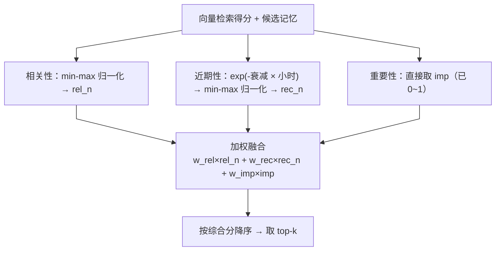

```mermaid
%%{init: {'flowchart': {'curve': 'linear'}}}%%
flowchart TD
    IN["向量检索得分 + 候选记忆"] --> REL["相关性：min-max 归一化 → rel_n"]
    IN --> REC["近期性：exp(-衰减 × 小时) → min-max 归一化 → rec_n"]
    IN --> IMP["重要性：直接取 imp（已 0~1）"]
    REL --> SUM["加权融合<br/>w_rel×rel_n + w_rec×rec_n + w_imp×imp"]
    REC --> SUM
    IMP --> SUM
    SUM --> RANK["按综合分降序 → 取 top-k"]
```